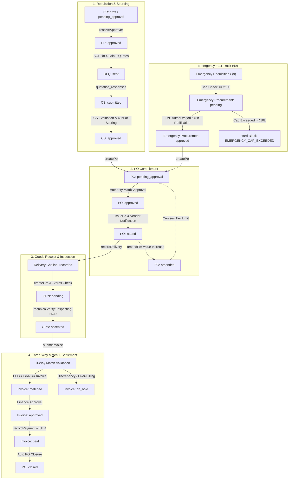
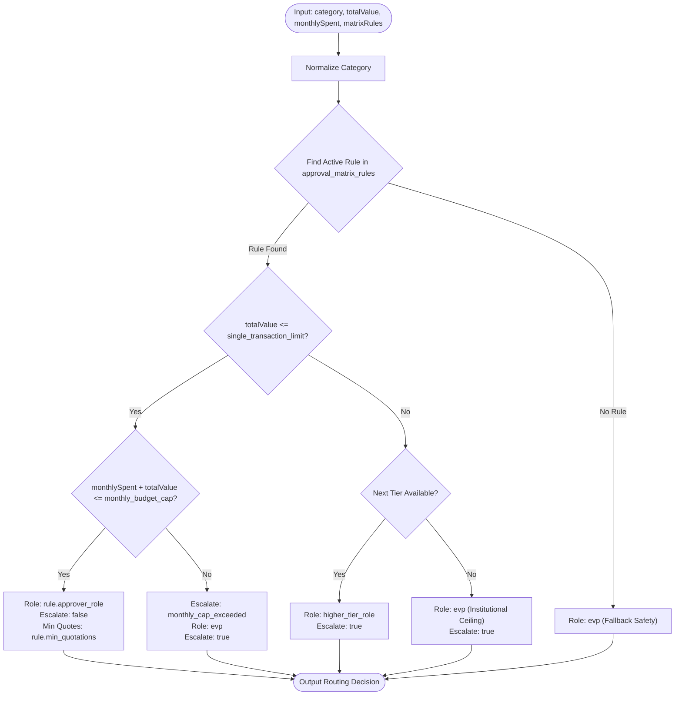
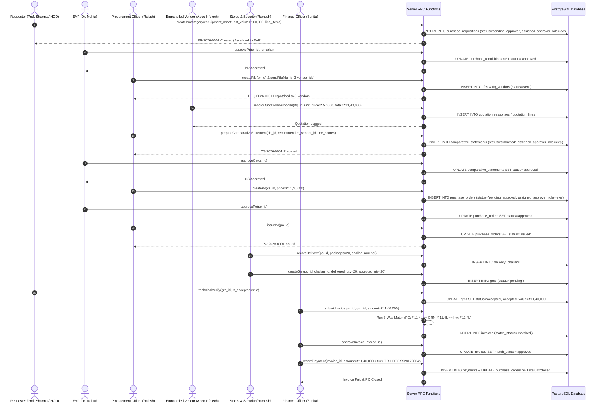
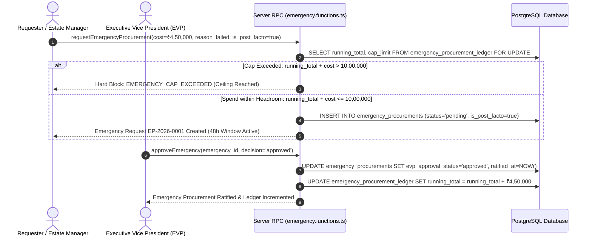
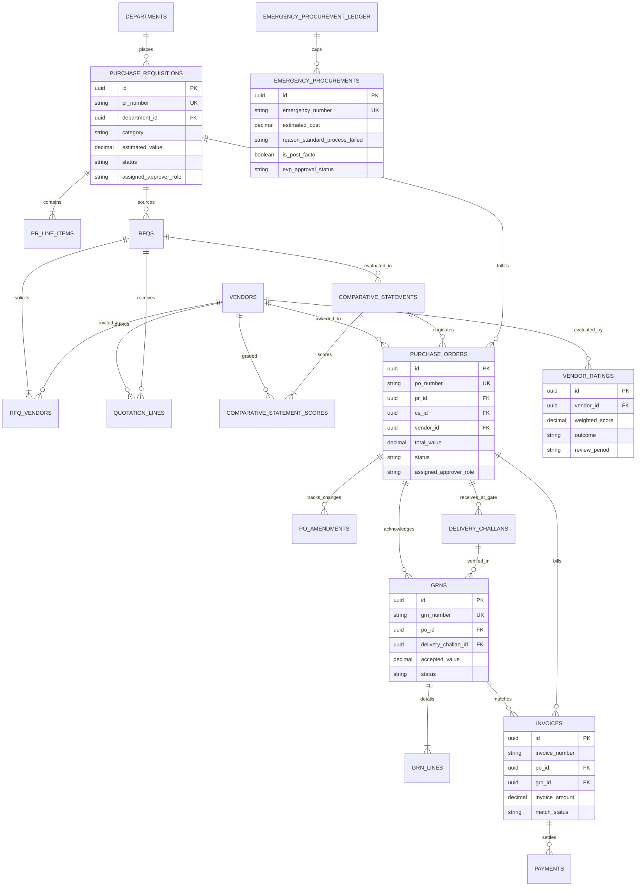
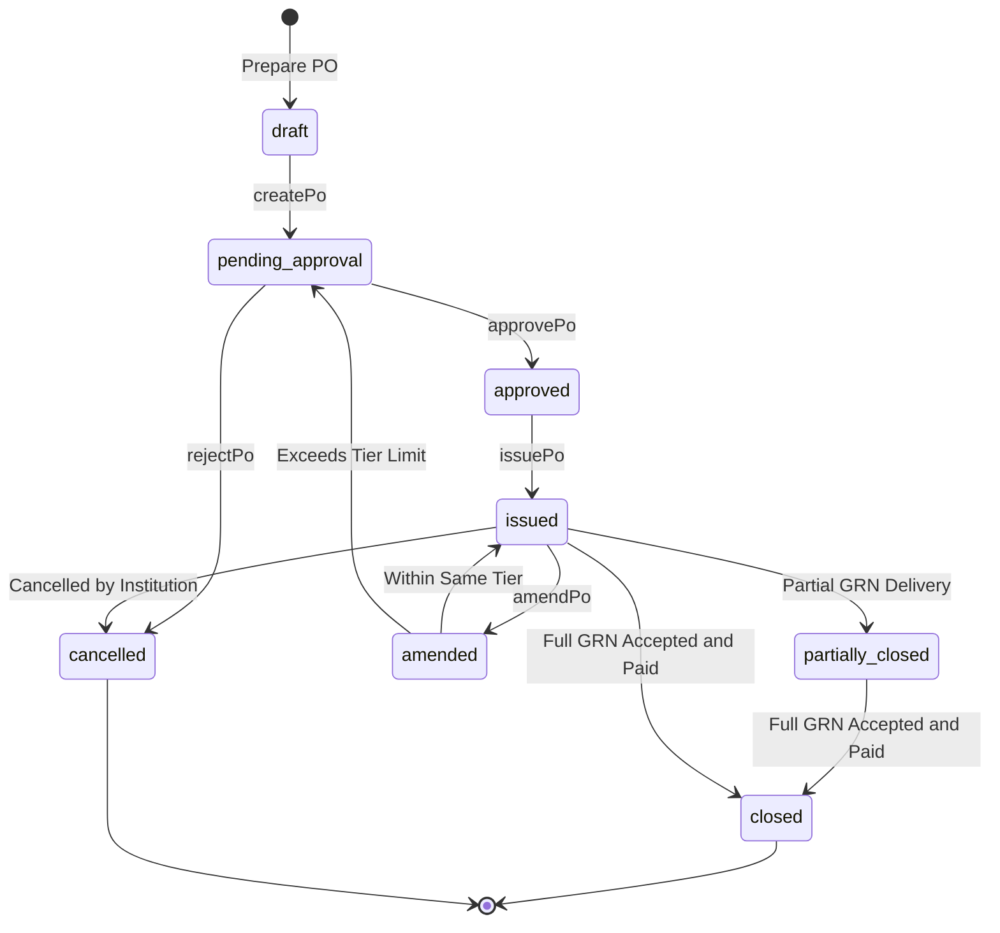

# AMC Inventory & Starlight Procure-to-Pay (P2P) Enterprise System

A modern, compliant Procure-to-Pay (P2P) and Inventory Management web application built with **TanStack Start (React 19, Vite 7)**, **Supabase PostgreSQL**, **Tailwind CSS**, and **TypeScript**.

The system fully enforces the **Starlight P2P Standard Operating Procedure (SOP)** with server-authoritative approval routing, statutory expenditure caps, three-way matching, and vendor governance.

---

## 1. System Architecture

The architecture enforces a strict **three-tier boundary**:

```
┌─────────────────────────────────────────────────────────┐
│                    React UI Screens                     │
│  (PR Raise, Vendor Empanelment, RFQ, CS, PO, GRN, Inv)  │
└────────────────────────────┬────────────────────────────┘
                             │  Typed RPC Invocations
                             ▼
┌─────────────────────────────────────────────────────────┐
│              Server Functions Tier (RPCs)               │
│         (src/server/procurement/*.functions.ts)         │
│  • Role Re-derivation from verified auth session        │
│  • Pure Domain Logic (authorityMatrix.ts, guards.ts)   │
└────────────────────────────┬────────────────────────────┘
                             │  Direct SQL / Service Role
                             ▼
┌─────────────────────────────────────────────────────────┐
│                   Supabase PostgreSQL                   │
│  • 19 Procurement Tables with Default-DENY RLS          │
│  • Atomic Number Sequences (PR-, RFQ-, CS-, PO-, GRN-)  │
│  • Strongly-typed Schema (types.ts with 0 any types)    │
└─────────────────────────────────────────────────────────┘
```

### Key Architectural Principles

1. **Server-Side Enforcement**: No client component performs direct mutations (`insert`, `update`, `delete`) on procurement tables. All writes go through `src/server/procurement/*` server functions.
2. **Pure Rules Engine**: `src/lib/procurement/authorityMatrix.ts` is table-driven with zero hardcoded thresholds.
3. **Default-DENY Security**: Every procurement table is locked with Default-DENY Row Level Security (RLS).
4. **Segregation of Duties**: Requisition (HOD) ≠ Sourcing (Procurement) ≠ Inspection (Stores/Security) ≠ Payment (Finance).

---

## 2. Procurement Modules & Lifecycle

1. **Requisitions (`/procurement/raise-pr`)**: Dynamic line items, net quantity auto-calculation against store inventory, Annexure-2 metadata, live matrix preview, and non-conflict declaration.
2. **Vendor Empanelment (`/procurement/vendors`)**: Statutory registration application, 4-pillar committee evaluation (Technical, Experience, Support, Financials), and strict EVP approval gate with 1-year validity.
3. **RFQ & Quotation Sourcing (`/procurement/rfqs`)**: Minimum 3 empanelled vendors selection, quotation response portal (`/quotation/$id`), line-item pricing, warranty/delivery capture, and technical specification compliance checks.
4. **Comparative Statements (`/procurement/cs`)**: 4-pillar vendor scoring, automated ranking, mandatory non-lowest rationale enforcement when bypassing L1 bidder, and committee/EVP authority routing.
5. **Purchase Orders (`/procurement/orders`)**: Regular and 6-month rate contract POs, automated distribution, amendment history with automatic tier escalation re-approval, and 30-day PO-splitting window guards.
6. **Delivery & GRN Hub (`/procurement/grns`)**: Delivery Challan registration at security gate, dual-stage sign-off (Security Gate Inward + Inspecting Engineer Technical sign-off), and cumulative overdelivery prevention.
7. **Invoices & 3-Way Match (`/procurement/invoices`)**: Automated pure 3-way match comparator (PO committed value ↔ GRN accepted value ↔ Claimed invoice amount). Mismatches transition to `on_hold` with legible discrepancy notes. Service PO completion certificate exception (§I2). Finance payment logging with external UTR reference.
8. **Emergency Procurement (`/procurement/emergency`)**: Hard-blocked at **₹10,00,000 per Indian Financial Year**, EVP-only authorization, and 48-hour post-facto ratification enforcement.
9. **Vendor Performance Ratings (`/procurement/vendor-ratings`)**: Annexure 4 6-weighted sections evaluation, Section E N/A proportional redistribution, 5 outcome bands (`Preferred`, `Active`, `Active Notice`, `Suspended`, `Debarred`), and EVP debarment sign-off.
10. **Unified Approvals Inbox (`/procurement/approvals`)**: Centralized multi-role authorization queue for PRs, CSs, POs, Amendments, Invoices, and Emergency Requests.

---

## 3. Database Migrations

Database definitions are versioned under `supabase/migrations/`:

- `20260918000001_day1_procurement_foundation.sql`: Roles, Vendors, PRs, Matrix Rules, Monthly Spend, Deviation Approvals.
- `20260918000002_day2_rfq_cs_po.sql`: Rate Contracts, RFQs, RFQ Vendors, Quotation Lines, CS, CS Scores, POs, PO Amendments.
- `20260918000003_day3_fulfilment_payment_emergency_ratings.sql`: Delivery Challans, GRNs, GRN Lines, Invoices, Payments, Emergency Ledger, Emergency Procurements, Vendor Ratings.

---

## 4. Getting Started & Verification

### Prerequisites

- Node.js 20+
- npm or bun

### Local Development

```sh
# Install dependencies
npm install

# Run development server
npm run dev

# Run TypeScript type check (0 errors required)
npx tsc --noEmit

# Run Vite production build
npm run build
```

### Running the Compliance Test Suites

```sh
# Day 1 & Day 2 Foundation & Sourcing Tests
node scripts/verify_day1.mjs
node scripts/verify_day2.mjs

# Day 3 Fulfilment, 3-Way Match & Ratings Tests
node scripts/verify_day3.mjs

# Day 4 Full Comprehensive Compliance Test Suite (59 Tests)
node scripts/verify_day4_compliance.mjs
```

---

## 5. Audit & Compliance Documentation

- [`docs/UI_WALKTHROUGH.md`](docs/UI_WALKTHROUGH.md) — Screen-by-screen, field-level real-world operational UI walkthrough across all 20 steps.
- [`docs/P2P_SOP_Audit_FINAL.md`](docs/P2P_SOP_Audit_FINAL.md) — Complete 42-area traceability matrix and scorecard comparing Day 0 vs. Day 4.
- [`docs/E2E_WALKTHROUGH.md`](docs/E2E_WALKTHROUGH.md) — Step-by-step logs and state progression of 3 end-to-end cycles.
- [`docs/OPEN_DECISIONS_FOR_SIGNOFF.md`](docs/OPEN_DECISIONS_FOR_SIGNOFF.md) — Operational and financial decisions presented for SOP Owner / EVP sign-off.
- [`docs/KNOWN_GAPS.md`](docs/KNOWN_GAPS.md) — Prioritized backlog for secondary UI screens and background cron jobs.
- [`DAY1_LOG.md`](DAY1_LOG.md), [`DAY2_LOG.md`](DAY2_LOG.md), [`DAY3_LOG.md`](DAY3_LOG.md) — Daily execution logs.

---

## 6. System Workflow Diagrams

### Diagram 1: Overall P2P Lifecycle Flowchart

The following flowchart illustrates the complete procure-to-pay lifecycle across standard and emergency paths, using the database status enum values (`draft`, `pending_approval`, `approved`, `sent`, `submitted`, `issued`, `matched`, `on_hold`, `paid`, `closed`).



_Derived from `supabase/migrations/` schema definitions, `src/server/procurement/*.functions.ts`, and Starlight P2P SOP §8._

---

### Diagram 2: Authority Matrix Decision Flowchart

The following decision tree shows how `resolveApprover` evaluates transaction category, single transaction ceilings, and cumulative monthly spend caps to determine the approval authority role and escalation requirement.



_Derived from `src/server/procurement/authorityMatrix.ts` and `approval_matrix_rules` database seed data._

---

### Diagram 3: Cycle 1 Standard Procurement Sequence Diagram

The following sequence diagram details the complete message exchanges, RPC calls, and database mutations between all eight procurement actors for an IT equipment purchase exceeding standard limits.



_Derived from `src/server/procurement/*.functions.ts`, `docs/E2E_WALKTHROUGH.md`, and `docs/UI_WALKTHROUGH.md`._

---

### Diagram 4: Cycle 2 Emergency Procurement Sequence Diagram

The following sequence diagram demonstrates the annual statutory cap verification, the hard-block branch, and the 48-hour post-facto ratification mechanism under SOP §9.



_Derived from `src/server/procurement/emergency.functions.ts` and `20260918000003_day3_fulfilment_payment_emergency_ratings.sql`._

---

### Diagram 5: Entity-Relationship Diagram (ERD)

The following entity-relationship diagram illustrates the core procurement database entities, their primary/foreign keys, and relational constraints across the entire schema.



_Derived from PostgreSQL migration files `supabase/migrations/20260918000001_day1_procurement_foundation.sql`, `20260918000002_day2_rfq_cs_po.sql`, and `20260918000003_day3_fulfilment_payment_emergency_ratings.sql`._

---

### Diagram 6: Purchase Order State Transition Diagram

The following state transition diagram depicts the lifecycle states of a Purchase Order, including the amendment and tier escalation re-approval loop.



_Derived from `src/server/procurement/po.functions.ts` and SOP §8.5._
